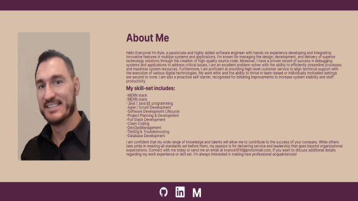
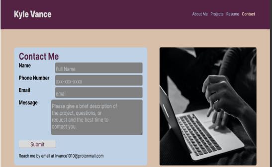

# Kyle-Vance-Portfolio

You’ll deploy this application to GitHub Pages. Follow the instructions in the Git Guide or consult the [Create React App Docs on GitHub Pages](https://create-react-app.dev/docs/deployment/#github-pages) to create a build that you can deploy


## Description

This project is designed to showcase my work. My portfolio is a way to share my projects not only to employers or working as a freelancer but also so that I can share my work with fellow developers and collaborate on future projects.

---

### Table of Contents

- [Installation](#installation)
- [Usage](#usage)
- [Technologies](#technologies)
- [User-Story](#user-story)
- [Acceptance-Criteria](#acceptance-criteria)
- [Screenshots](#screenshots)
- [CodeSnippets](#codeSnippets)
- [License](#license)
- [Contributors](#contributors)
- [Tests](#tests)
- [Important-Information-Questions](#important-information-questions)

---

## Technologies

- **React**
- **CSS**
- **JavaScript**
- **GitHub**

---

## User Story

```md
AS AN employer looking for candidates with experience building single-page applications
I WANT to view a potential employee's deployed React portfolio of work samples
SO THAT I can assess whether they're a good candidate for an open position
```

## Acceptance Criteria

```md
GIVEN a single-page application portfolio for a web developer
WHEN I load the portfolio
THEN I am presented with a page containing a header, a section for content, and a footer
WHEN I view the header
THEN I am presented with the developer's name and navigation with titles corresponding to different sections of the portfolio
WHEN I view the navigation titles
THEN I am presented with the titles About Me, Portfolio, Contact, and Resume, and the title corresponding to the current section is highlighted
WHEN I click on a navigation title
THEN I am presented with the corresponding section below the navigation without the page reloading and that title is highlighted
WHEN I load the portfolio the first time
THEN the About Me title and section are selected by default
WHEN I am presented with the About Me section
THEN I see a recent photo or avatar of the developer and a short bio about them
WHEN I am presented with the Portfolio section
THEN I see titled images of six of the developer’s applications with links to both the deployed applications and the corresponding GitHub repositories
WHEN I am presented with the Contact section
THEN I see a contact form with fields for a name, an email address, and a message
WHEN I move my cursor out of one of the form fields without entering text
THEN I receive a notification that this field is required
WHEN I enter text into the email address field
THEN I receive a notification if I have entered an invalid email address
WHEN I am presented with the Resume section
THEN I see a link to a downloadable resume and a list of the developer’s proficiencies
WHEN I view the footer
THEN I am presented with text or icon links to the developer’s GitHub and LinkedIn profiles, and their profile on a third platform (Stack Overflow, Twitter)
```

## Screenshots

#### AboutMe Page



#### Contact Page



---

## CodeSnippets

#### Header component

```JavaScript
function Header({ currentPage, handlePageChange }){
    return (
        <header className="header">
            <a className="logo_container" onClick={() => handlePageChange('Home')} href='#home'>Kyle Vance</a>
            <Nav currentPage={currentPage} handlePageChange = {handlePageChange}/>
        </header>
    )
}
```

#### Project cards

```javascript
export default function Projects({ projects }) {
	return (
		<div className="project_group_portfolio">
			{projects.map((project) => (
				<div className="projects" key={project.id}>
					
					<div className="project_box">
						<h3 className="proTitle">{project.title}</h3>
					</div>
					<div className="overlay">
						<div className="overlayText">
							<p>
								<span className="overlayTitle">Title: </span>
								{project.title}
							</p>
							<p>
								<span className="overlayTitle">Description: </span>
								{project.description}
							</p>
							<p>
								<span className="overlayTitle">Technologies: </span>
								{project.technology}
							</p>
							<div className="overlayLinks">
								<a href={project.liveLink} target="_blank">
									Live Link
								</a>
								<a href={project.gitLink} target="_blank">
									GitHub Link
								</a>
							</div>
						</div>
					</div>
				</div>
			))}
		</div>
	);
}
```

---

## Tests

N/A

---

## **Important-Information-Questions**

---

## License

The license used on this project was MIT license

[license link](https://opensource.org/licenses/MIT)

## Contributors

Kyle Vance

## Questions

If you have any questions regarding this project, please reach me by email at vanceofalifetime@protonmail.com

[Live Link](https://kvance1010.github.io/kyle-vance-portfolio/#about)

[LinkedIn](https://www.linkedin.com/in/kyle-s-vance/)
